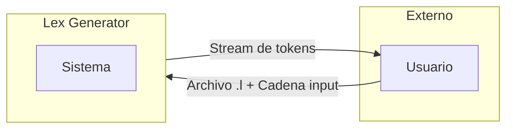
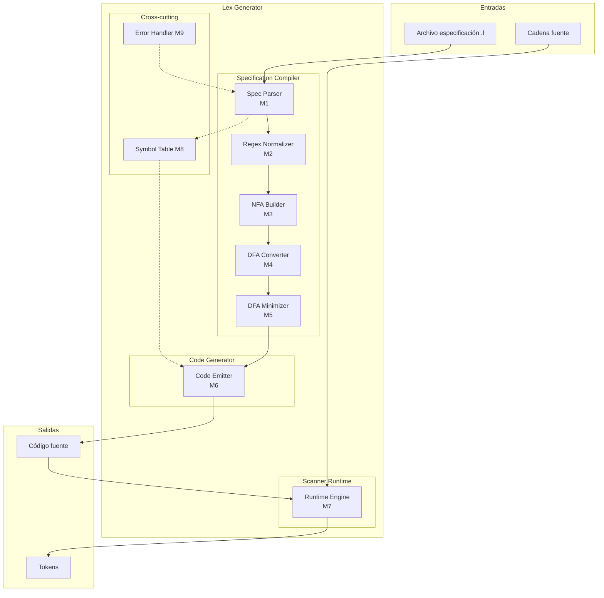
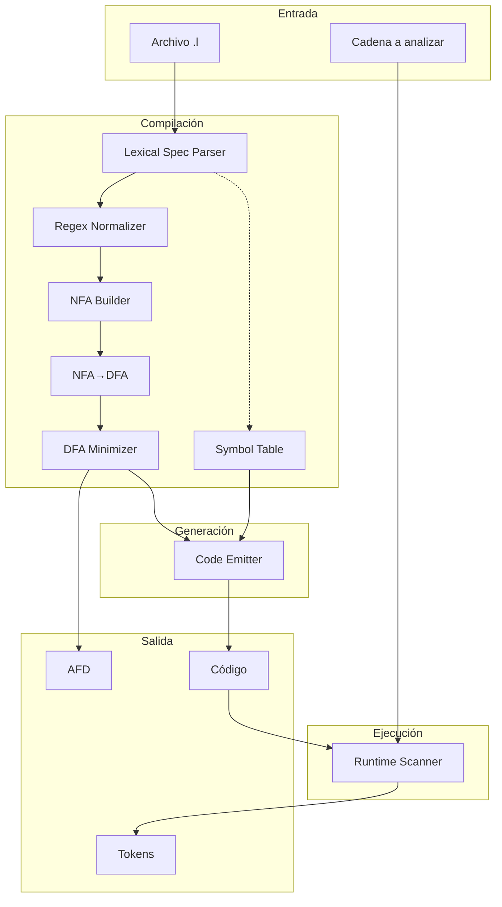
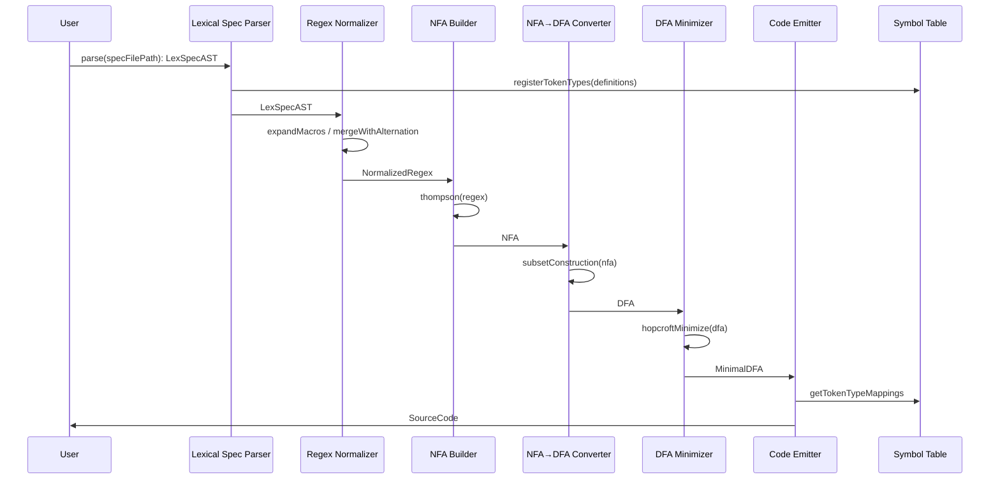
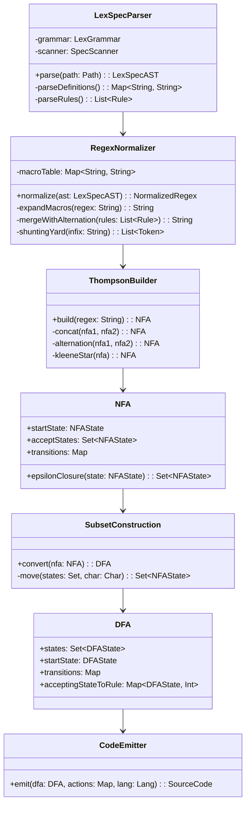
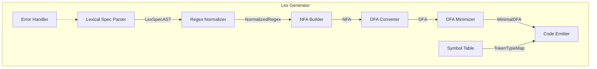
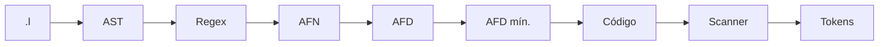

# Arquitectura del Generador de Analizadores Léxicos

**Versión:** 1.0 — Febrero 2025

---

## 1. Alcance

Un generador de analizadores léxicos toma especificaciones de tokens (expresiones regulares con asociación a acciones) y produce código ejecutable que realiza la tokenización de cadenas de entrada. El diseño que se presenta organiza este proceso en módulos acotados, con flujos de datos explícitos y énfasis en RNF (rendimiento, confiabilidad, mantenibilidad, escalabilidad).

---

## 2. Fases del sistema

La herramienta opera en tres grandes etapas:

| Fase | Entrada | Salida |
|------|---------|--------|
| Compilación de especificación | Archivo `.l` / `.lex` | AFN/AFD + tablas de acciones |
| Generación de código | AFD minimizado | Código fuente (C, Java, etc.) |
| Ejecución | Scanner compilado + input | Secuencia de tokens |

---

## 3. Módulos

### Desglose

```
┌─────────────────────────────────────────────────────────────────────────────┐
│                    LEX GENERATOR - ARQUITECTURA MODULAR                      │
├─────────────────────────────────────────────────────────────────────────────┤
│  M1: Lexical Spec Parser    │  M2: Regex Normalizer    │  M3: NFA Builder   │
│  M4: NFA→DFA Converter     │  M5: DFA Minimizer       │  M6: Code Emitter  │
│  M7: Runtime Engine         │  M8: Symbol Table        │  M9: Error Handler │
└─────────────────────────────────────────────────────────────────────────────┘
```

### Responsabilidades e I/O

| Módulo | Función | Input | Output |
|--------|---------|-------|--------|
| **M1: Lexical Spec Parser** | Parseo del archivo `.l` y construcción del AST de especificación | Archivo `.l` | AST |
| **M2: Regex Normalizer** | Expansión de macros y unificación de reglas en una sola regex | AST | Regex normalizada |
| **M3: NFA Builder** | Construcción de AFN vía algoritmo de Thompson | Regex | AFN |
| **M4: NFA→DFA Converter** | Subset construction | AFN | AFD |
| **M5: DFA Minimizer** | Minimización de estados (Hopcroft) | AFD | AFD mínimo |
| **M6: Code Emitter** | Emisión de código del scanner | AFD mínimo + acciones | Código fuente |
| **M7: Runtime Engine** | Ejecución del scanner sobre el input | Código + cadena | Stream de tokens |
| **M8: Symbol Table** | Mapeo de identificadores a tipos de token | Definiciones | Tabla de símbolos |
| **M9: Error Handler** | Reporte y recuperación ante errores | Excepciones | Mensajes / estado recuperado |

---

## 4. High-Level Design (HLD)

### 4.1 Contexto del sistema (nivel 0)



### 4.2 Diagrama HLD — subsistemas (nivel 1)



### 4.3 Bloques HLD — responsabilidades

| Bloque | Módulos | Responsabilidad |
|--------|---------|-----------------|
| **Specification Compiler** | M1–M5 | Parsear `.l`, normalizar regex, construir AFN, convertir a AFD, minimizar |
| **Code Generator** | M6 | Emitir código del scanner a partir del AFD y tablas de acciones |
| **Scanner Runtime** | M7 | Ejecutar el scanner compilado sobre la cadena de entrada |
| **Cross-cutting** | M8, M9 | Tabla de símbolos y manejo de errores en todo el pipeline |

---

## 5. Diagramas de detalle

### 5.1 Flujo de datos general



### 5.2 Secuencia del pipeline de compilación



### 4.3 Clases principales



### 5.4 Vista de componentes



---

## 5. Firmas de métodos

### M1 — Lexical Spec Parser

```java
LexSpecAST parse(Path specFilePath);
// LexSpecAST: getMacroDefinitions(), getRules(), getActionCodes(), getUserCode()
```

### M2 — Regex Normalizer

```java
NormalizedRegex normalize(LexSpecAST ast);
// expandMacros(), mergeWithAlternation(), shuntingYard() / infixToPostfix()
```

### M3 — NFA Builder (Thompson)

```java
NFA build(String regex);
// literal(char), concat(nfa1, nfa2), alternation(nfa1, nfa2), kleeneStar(nfa)
```

### M4 — NFA→DFA

```java
DFA convert(NFA nfa);
// epsilonClosure(states), move(states, char), getOrCreateDFAState(nfaStates)
```

### M5 — DFA Minimizer

```java
DFA minimize(DFA dfa);
// initialPartition(), refinePartition(), buildMinimalDFA()
```

### M6 — Code Emitter

```java
SourceCode emit(DFA dfa, Map<Integer, String> actions, TargetLanguage lang);
```

---

## 7. Ejemplo: gramática mini y cadena de prueba

### Gramática

```
%%
DIGIT   [0-9]
LETTER  [a-zA-Z]
ID      {LETTER}({LETTER}|{DIGIT})*
NUM     {DIGIT}+
%%
{ID}    { return TOKEN_ID; }
{NUM}   { return TOKEN_NUM; }
"+"     { return TOKEN_PLUS; }
"*"     { return TOKEN_STAR; }
"="     { return TOKEN_EQ; }
[ \t\n]+ { /* skip */ }
%%
```

### Cadena

```
foo = 42 + x7
```

### Recorrido por fases

**M1 — Parser**

El AST contiene las definiciones de macros (DIGIT, LETTER, ID, NUM) y las reglas con sus prioridades y acciones. Cada regla queda asociada a un `actionId`.

**M2 — Normalizer**

Se expanden las macros y se unifica todo en una sola expresión con alternancia. Ejemplo de regex unificada:

```
([a-zA-Z]([a-zA-Z]|[0-9])*)|([0-9]+)|(\+)|(\*)|(=)|([ \t\n]+)
```

**M3 — NFA Builder**

A partir de la regex en postfix se construye el AFN mediante Thompson. Cada literal, concatenación, alternancia y clausura de Kleene genera subgrafos que se integran en el AFN global.

**M4 — Subset construction**

Se obtiene el AFD equivalente. Cada estado del AFD corresponde a un conjunto de estados del AFN. Las transiciones se determinan con `move` y `epsilonClosure`.

**M5 — Minimización**

Hopcroft reduce el número de estados agrupando equivalentes en particiones.

**M6 — Code Emitter**

Se emite una tabla de transiciones y un driver que, en cada paso, avanza el estado según el carácter leído y dispara la acción asociada al estado de aceptación.

**M7 — Runtime sobre `foo = 42 + x7`**

| Lexema | Token |
|--------|-------|
| foo | TOKEN_ID |
| (espacio) | skip |
| = | TOKEN_EQ |
| (espacio) | skip |
| 42 | TOKEN_NUM |
| (espacio) | skip |
| + | TOKEN_PLUS |
| (espacio) | skip |
| x7 | TOKEN_ID |
| EOF | TOKEN_EOF |

---

## 8. Patrones de diseño

- **Builder**: construcción incremental del AFN y del código emitido.
- **Strategy**: alternativas de minimización (Hopcroft, Moore) y de lenguajes objetivo en el emitter.
- **Visitor**: recorrido del AST sin acoplar lógica al árbol.
- **Factory**: creación de estados y transiciones en NFA/DFA.
- **Facade**: orquestador del pipeline que oculta la complejidad de los módulos internos.
- **Pipeline**: flujo lineal donde cada módulo consume la salida del anterior.

---

## 9. Requerimientos no funcionales

| RNF | Enfoque |
|-----|---------|
| Rendimiento | Tabla de transiciones O(1) por carácter; DFA minimizado; compilación separada de la ejecución |
| Confiabilidad | Validación por fase; error handler centralizado; recuperación ante caracteres ilegales |
| Escalabilidad | Módulos desacoplados; sub-AFNs construibles en paralelo |
| Mantenibilidad | Interfaces bien definidas; cohesión por módulo; pruebas por fase |
| Seguridad | Validación estricta en el parser; límites de recursión en la expansión de regex |
| Extensibilidad | Nuevos targets de código vía Strategy; nuevos operadores regex vía Visitor |

---

## 10. Flujo resumido



---

## Referencias

- Aho, Sethi, Ullman — *Compilers: Principles, Techniques, and Tools*
- Thompson, K. — *Regular Expression Search Algorithm* (CACM 1968)
- Hopcroft, J. — *An n log n Algorithm for Minimizing States in a Finite Automaton*
